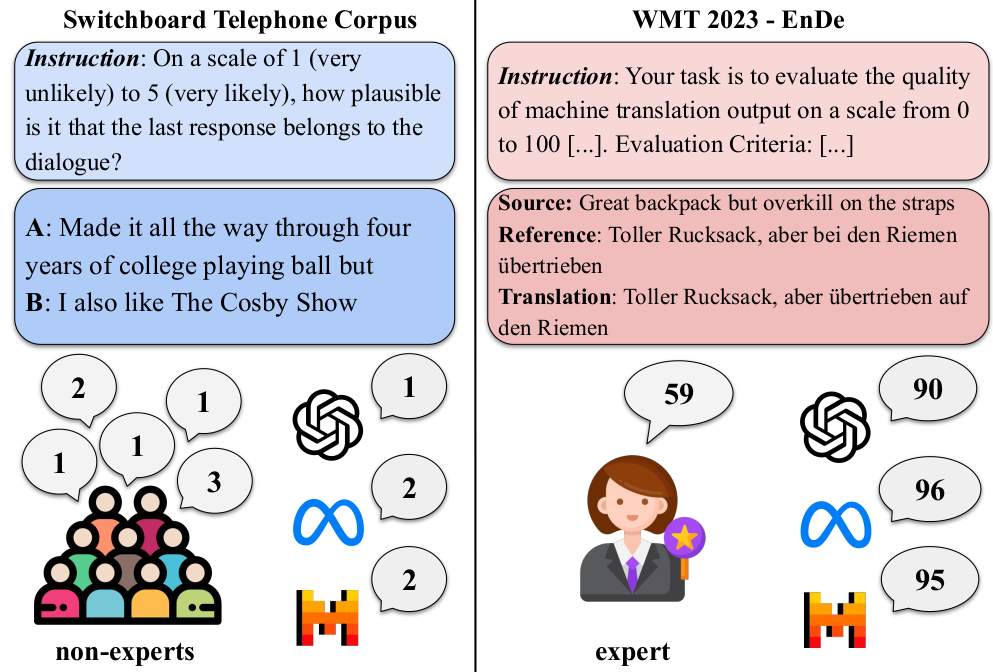

# LLMs instead of Human Judges? A Large Scale Empirical Study across 20 NLP Evaluation Tasks

Paper link: https://arxiv.org/abs/2406.18403



## Data

Check the [data](https://github.com/dmg-illc/JUDGE-BENCH/tree/master/data) directory for preparing the test data.

## Model responses

The script `prompt_model_json.py` automatically runs an LLM on a(ll) dataset(s) and stores the model's responses. It uses the prompt that was provided with the dataset, and allows for additions to this prompt e.g. to request short answers from the model. It stores a .json file per model and dataset, which contains model responses and details of the run (e.g. batch size, additional prompts used) in addition to all information from the input data file. Example usage:

```
python prompt_model_json.py -d cola -t YOUR_HF_TOKEN -m meta-llama/Meta-Llama-3.1-70B-Instruct -b 8 -nt 25 -ap 1 -rd results
```
If you do not specify a dataset, model responses are generated for all datasets in Judge-Bench:

```
python prompt_model_json.py -t YOUR_HF_TOKEN -m meta-llama/Meta-Llama-3.1-70B-Instruct -b 8 -nt 25 -ap 1 -rd results
```

### Datasets
Currently, the dataset arguments corresponding to all datasets in Judge-Bench are:
```
{"cola","cola-grammar","dailydialog-acceptability","inferential-strategies","llmbar-adversarial","llmbar-natural",
"medical-safety","newsroom","persona_chat","qags","recipe_crowd_sourcing_data","roscoe-cosmos","roscoe-drop",
"roscoe-esnli","roscoe-gsm8k","summeval","switchboard-acceptability","topical_chat","toxic_chat-train",
"toxic_chat-test","wmt-human_en_de","wmt-human_zh_en","wmt-23_en_de","wmt-23_zh_en","dices_990","dices_350_expert",
"dices_350_crowdsourced"}
```
### Models
The arguments corresponding to models that have been evaluated on Judge-Bench are:
```
{"berkeley-nest/Starling-LM-7B-alpha","mistralai/Mistral-7B-Instruct-v0.3","meta-llama/Meta-Llama-3.1-8B-Instruct",
"meta-llama/Meta-Llama-3.1-70B-Instruct","CohereForAI/c4ai-command-r-v01","CohereForAI/c4ai-command-r-plus",
"mistralai/Mixtral-8x22B-Instruct-v0.1","mistralai/Mixtral-8x7B-Instruct-v0.1","allenai/OLMo-7B-0724-Instruct-hf",
"gpt-4o", "gemini-1.5-flash-latest"}
```
The open-source models are obtained through HuggingFace, so obtaining results for a different model that is available on HuggingFace can be done simply by specifying its name as the model argument. In order to obtain responses from a different proprietary model, the `APIModel` class in `models.py` might need small modifications depending on the specific API.

## Evaluation

Next, the script `eval_responses.py` computes the correlation metrics from the human evaluations and model responses stored at the previous step. Depending on the type of judgments (graded, categorical), the relevant metrics are computed (correlation scores for graded judgments and Cohen's Kappa for categorical ones). This script also computes the agreement between humans (Krippendorff's Alpha) for datasets with multiple judgments per instance. Example usage:

```
python eval_responses.py -rd results -d cola -m meta-llama/Meta-Llama-3.1-70B-Instruct
```
This script saves a .json file for each dataset, which can be used to reproduce the tables and figures from the paper in `results_notebook.ipynb`.

## Citation

If you use this work, please cite:

```bibtex
@inproceedings{Bavaresco2024JUDGE_BENCH,
  title={LLMs instead of Human Judges? A Large Scale Empirical Study across 20 NLP Evaluation Tasks},
  author={Anna Bavaresco and Raffaella Bernardi and Leonardo Bertolazzi and Desmond Elliott and Raquel Fernández and Albert Gatt and E. Ghaleb and Mario Giulianelli and Michael Hanna and Alexander Koller and André F. T. Martins and Philipp Mondorf and Vera Neplenbroek and Sandro Pezzelle and Barbara Plank and David Schlangen and Alessandro Suglia and Aditya K Surikuchi and Ece Takmaz and Alberto Testoni},
  year={2024},
  url={https://arxiv.org/abs/2406.18403}
}
